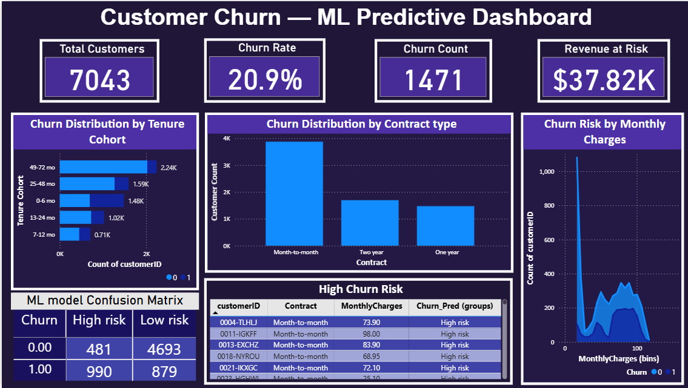

# 📊 Customer Churn Prediction using Machine Learning

An end-to-end Machine Learning project that predicts customer churn using classification models and visualizes business insights through an interactive Power BI dashboard.

---

## 📸 Dashboard Preview

  

---

## 🚀 Project Overview

This project uses Machine Learning to predict whether a telecom customer is likely to churn. Multiple classification models are trained and the best-performing model is used to generate predictions. The results are then visualized in an interactive Power BI dashboard for business analysis.

---

## 🛠️ Tech Stack

- Python
- Pandas
- NumPy
- Matplotlib
- Seaborn
- Scikit-learn
- Power BI

---

## 🤖 Machine Learning Models

- Logistic Regression
- Random Forest Classifier
- Decision Tree Classifier

The best-performing model is automatically selected to generate customer churn predictions.

---

## ▶️ How to Use

1. Clone this repository.
2. Install the required libraries.
3. Open and run **Customer_Churn.ipynb**.
4. The notebook trains the models and generates **churn_predictions.csv**.
5. Open the Power BI dashboard to explore the prediction results and customer insights.

---

## 🔍 Prediction Output

The generated **`churn_predictions.csv`** file contains a new column:

| Prediction | Meaning |
|------------|---------|
| **0** | Customer is likely to stay |
| **1** | Customer is likely to churn |

---

## 📊 Dashboard Highlights

- 📌 Total Customers
- 📌 Churn Rate
- 📌 Churn Count
- 📌 Revenue at Risk
- 📌 Churn by Contract Type
- 📌 Churn by Tenure Group
- 📌 Monthly Charges vs Churn Risk
- 📌 High-Risk Customer List
- 📌 Confusion Matrix
- 📌 Interactive Filters

---

## 💡 Key Insights

- Customers with month-to-month contracts have the highest churn rate.
- Customers with shorter tenure are more likely to churn.
- Higher monthly charges are associated with increased churn risk.
- Long-term contracts significantly improve customer retention.

---

⭐ If you found this project useful, consider giving it a star!
